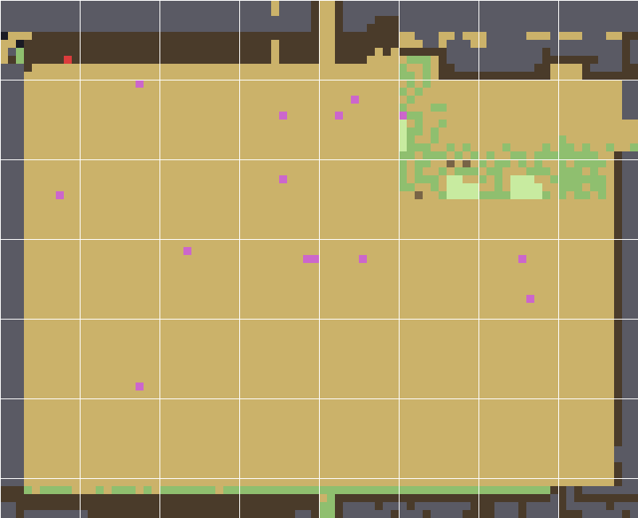

# Square Farm — modified `Farm.xnb` (v2)

A rebuilt **standard farm map** (the vanilla `Maps/Farm.xnb`): one clean rectangular
field of yellow sandy soil, a preserved vanilla house yard (green grass, fences,
stone path, patio), and neat uniform cliff edges all around the map.



## What changed (v2, feedback from screens 295–302)

| Area | Change |
|---|---|
| **Field** (x3–76, y9–60) | Uniform **yellow sandy soil** (tile 472, `Diggable` / `Type: Dirt` — tillable, trees & buildings placeable) instead of green grass. Every field tile carries `NoSpawn All`, so weeds / stones / forage / wild trees no longer respawn on it. |
| **House yard** (x50–77, y6–24) | Kept **byte-for-byte from vanilla**: the green grass rectangle around farmhouse, shipping bin and spouse patio, with the original fence lines (uncut), stone path and porch/patio. Player-removable debris tokens and the flower tufts that showed through the half-transparent house were stripped. |
| **North strip** (y0–9) | Trees, bushes, flowers, rocks, weeds and the pebbles on the north path removed; sprout variants on the cliff replaced with the plain cliff tile. Cliff, cave door, Grandpa's shrine, the statue ("totem"), farm sign and both corridors untouched. North path repainted to plain sand. |
| **West edge** | The grass strip + tree rows are gone. A neat, uniform 3-wide rock cliff band (x0–2, y8–60) replaces the vanilla mountain jut — one same level everywhere, no hills. |
| **East edge** | Outer column (x78–79) is the same uniform rock band; the vanilla BusStop gate (y15–18) and the east fence column at x77 are kept. |
| **South edge** (y61–64) | Restored to **vanilla**: cliff edge + the original fence line. The half-off-map pond in the SE corner is filled in with the same cliff. |
| **Ponds** | All water removed from the farm (see note below). |
| **Debris** | Every weed / stone / twig / stump / log / boulder / bush / tree spawn token stripped map-wide. |
| **Preserved** | All warps & approaches, cave door, greenhouse door, farm sign, 14 multiplayer-cabin markers with `Order`, the grass-init token the game requires, tilesheets untouched (recolor mods keep working). |

> **Note on fishing:** by request the farm is completely dry — no ponds, no water
> tiles at all — so fishing / crab pots live in other locations (Forest, Mountain,
> Beach…). Adding a small neat pond later is a one-line change in
> `tools/build_farm.py`.

## Install

1. **Back up** your Stardew folder's original file: `Content/Maps/Farm.xnb`.
2. Copy `output/Farm.xnb` into `Content/Maps/`, replacing the original.
3. Start the game (best on a **new save** — see v1 notes: things already baked into an
   old save stay where they are).

## Rebuilding from source

```bash
python3 tools/build_farm.py        # vanilla work/Farm.tbin -> work/Farm_modified.tbin (+validation)
python3 tools/pack_xnb.py work/Farm_modified.tbin output/Farm.xnb
python3 tools/render_farm.py work/Farm_modified.tbin work/preview_after.png after
```

- `tools/tbin.py` — TBin (tIDE) parser/writer (byte-exact round-trip verified).
- `tools/build_farm.py` — the whole rebuild as reproducible code, with a validation
  pass (warps, gates, corridors, cliff bands, yard preservation, field uniformity,
  cabin markers, no water, no debris…).
- `tools/pack_xnb.py` — packs a tbin into an **uncompressed** XNB (no external tools;
  the game / SMAPI load uncompressed XNBs fine).
- `tools/render_farm.py` — schematic renderer used for the previews.
- `work/Farm.tbin` / `work/Farm_modified.tbin` — extracted vanilla & modified maps.

Easy tweaks in `tools/build_farm.py`: field tile (`SAND = 472`), yard rectangle
(`YARD`), field rectangle (`FIELD`), cliff band tile (`ROCK = 176`).
