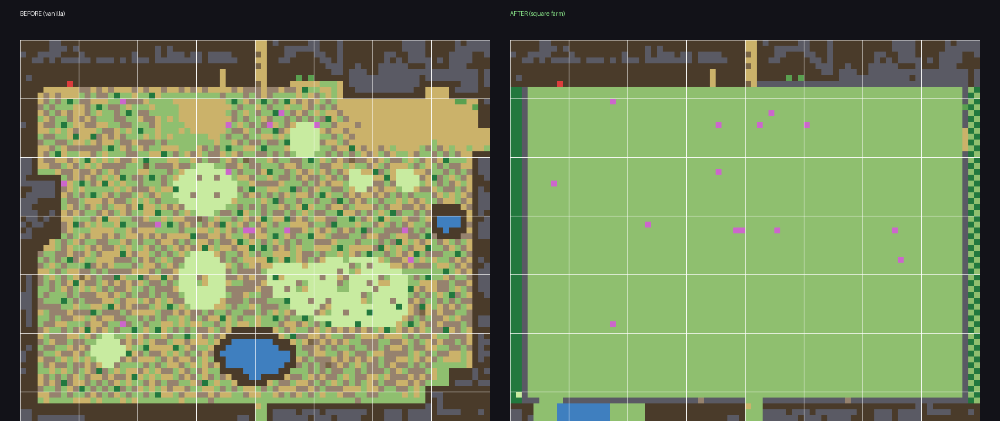

# Square Farm — modified `Farm.xnb`

A rebuilt **standard farm map** (the vanilla `Maps/Farm.xnb`): the farmable land is now a
perfectly square, completely clean field. All three ponds are gone; a small new pond sits
just outside the square in a fenced-in nook so fishing / crab pots still work.

## What changed

| Area | Change |
|---|---|
| **Shape** | The west cliff jut ("mountain"), jagged north-east corner and receding south-east corner are filled in — the usable land is one clean rectangle (x3–76, y8–60). |
| **Ground** | The entire square is uniform plain grass (tile 587, `Diggable`/`Type: Dirt` — fully tillable, trees plantable, buildings placeable). |
| **Ponds** | All three vanilla ponds removed. New pond (9×3 water tiles) outside the south wall in a small yard, reachable through a gate gap at x5–8 — so you can still fish and place crab pots. |
| **Walls** | Straight mossy-hedge borders on the west/east/south (plus the north-east stretch that was open cliff). The original north hill, greenhouse and cave entrance are untouched. |
| **Gates kept** | East → BusStop (y15–18), south → Forest (x40–42), north corridor → Backwoods (x40–41), cave door, greenhouse door, plus the new pond-yard gate. |
| **Trees** | All scattered vanilla trees removed; new tidy staggered rows (oak/maple/pine) flank the square *behind* the hedge walls, left and right. |
| **Debris** | Every weed / stone / twig / stump / log / boulder / bush spawn token stripped. (The game will not respawn them — spawn tokens are gone.) |
| **Preserved** | All warps & approaches, farmhouse/cellar area (runtime buildings draw there), greenhouse + cave doors, farm sign ("your farm" message), 14 multiplayer-cabin markers with their `Order` values, the grass-init token the game requires, tilesheets untouched (recolor mods keep working). |

## Install

1. **Back up** your Stardew folder's original file: `Content/Maps/Farm.xnb`.
2. Copy `output/Farm.xnb` into `Content/Maps/`, replacing the original.
3. Start the game. Remove the file (restore the backup) to go back to vanilla.

**Best on a new save.** On an existing save the map swaps in, but things already
"baked" into that save stay where they are: planted trees, grown grass, spawned
weeds/rocks, placed buildings (a building sitting on the old pond spot would keep
existing there — it just looks odd). A fresh save gets the clean square exactly as shown.

## Files

- `output/Farm.xnb` — the modified map, ready to install (uncompressed XNB, loads fine in the game/SMAPI).
- `tools/tbin.py` — TBin (tIDE) parser/writer (byte-exact round-trip verified).
- `tools/build_farm.py` — the whole rebuild as reproducible code, with a validation pass (warps, gates, door frames, cabin markers, tillable ground, walls…).
- `tools/render_farm.py` — schematic renderer used for the previews.
- `work/Farm.tbin` / `work/Farm_modified.tbin` — extracted vanilla & modified maps.

## Want tweaks?

Easy one-line changes in `tools/build_farm.py`:
tree density (`cycle` / the row loop), pond size/position (`range(8, 17)`, `yy` rows),
wall look (`HEDGE = 176` — e.g. stone-hedge or fence-post indices from
`spring_outdoorsTileSheet`), or keep some debris. Then re-run
`python3 tools/build_farm.py` and repack (see the pack step in git history / ask me).
